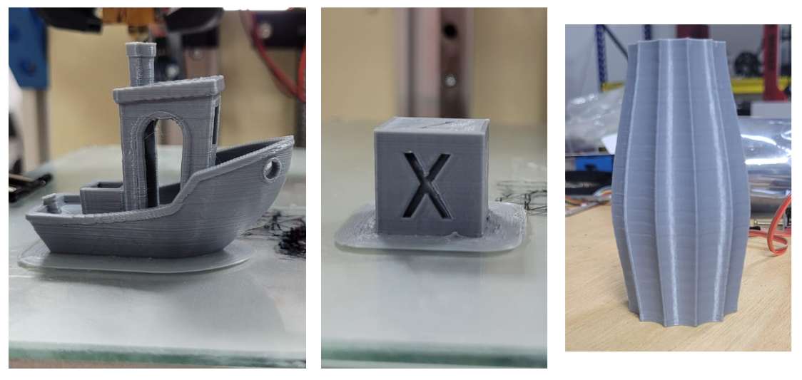

<h1 style=align="center">Tiny ULTOR</h1>

Introduction 
--
Welcome to the **TINY ULTOR** machine documentation.

**We are excited to share our open-source 3D printer project in collaboration with Inmachines Gmbh!!**

Specifications
--
- Build volume: 200x200x200mm
- Sturdy aluminium frame for stability and reduced vibration
- bed: aluminum with  non-sticking layer
- motion: COREXY system with GT2 6mm belt, Z axis: Sfu 1204 Ballscrew.
- guides: 9 & 12mm linear shaft, Hiwin MGN Series 9 & 12mm linear rails. MGN9 for XY axis an MGN12 for Z axis.
- motors: stepper motor NEMA 17
- drivers: trinamic TMC2208
- adjustable and heated printing bed
- Screens: Touchscreen HMI interface for easy operation / Reprap LCD 2004
- Pcb Board: **Rumba3D**

Files 
--
 - **[CAD Files](https://github.com/FAB619/ULTOR3020/tree/main/CAD)**
 - **[Fabrication Files](https://github.com/FAB619/Tiny_Ultor_3D/tree/main/Fabrication)**
- **[Assembly Book]()**
- **[Firmware ]()**

3D printing Test 
--

Acknowledgements
--
The development of this machine is part of **Digital4Job Project** implemented by: 
* **[Helmut-Schmidt-Universität Universität der Bundeswehr](https://www.hsu-hh.de/en/)** Laboratorium Fertigungstechnik Holstenhofweg 85 22043 Hamburg
* **[OpenLab Hamburg](https://openlab-hamburg.de/startpage/)**
* **[GIZ](https://www.giz.de/en/worldwide/326.html)**

In partnership with: 
* **[InMachines Ingrassia GmbH](https://www.inmachines.net/)**

* **[Fab619 On-Demand-Fabrication](https://fab619.tn/)**

License
--

Hardware design, CAD and PCB files, BOM, settings and other technical or design files are released under the following license:

- CERN Open Hardware Licence Version 2 Weakly Reciprocal - **[CERN-OHL-W](LICENSE_CERN_OHL_W_V2.txt)**

Assembly manual, pictures, videos, presentations, description text and other type of media are released under the following license:

- Creative-Commons-Attribution-ShareAlike 4.0 International - **[CC BY-SA 4.0](LICENSE_CC_BY_SA_4.0.txt)**

**License Owner **[InMachines Ingrassia GmbH](https://www.inmachines.net/)****

Author
--

**Tiny ULTOR** 3D Printer has been designed and built by **[Fab619 On-Demand-Fabrication](https://fab619.tn/)** & **[InMachines Ingrassia GmbH](https://www.inmachines.net/)**.

 

Machine design:
- **[Kais ALILA](http://fabacademy.org/2020/labs/kamplintfort/students/kais-alila/)**

- **[Mhamed ALILA](https://www.behance.net/alilamhamed)**

Note
--
This documentation will be continuously improved as soon there are updates and/or improvements on the machine.

Disclaimer
--

This hardware/software is provided "as is", and you use the hardware/software at your own risk. Under no circumstances shall any author be liable for direct, indirect, special, incidental, or consequential damages resulting from the use, misuse, or inability to use this hardware/software, even if the authors have been advised of the possibility of such damages.