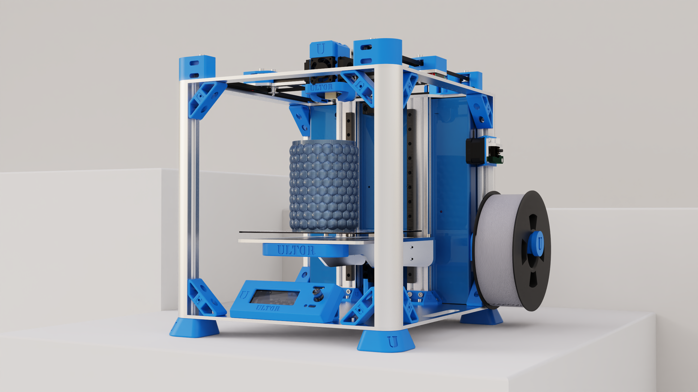

<h1 style=align="center">ULTOR3020</h1>

License
--

Hardware design, CAD and PCB files, BOM, settings and other technical or design files are released under the following license:

- CERN Open Hardware Licence Version 2 Weakly Reciprocal - **[CERN-OHL-W](LICENSE_CERN_OHL_W_V2.txt)**

Assembly manual, pictures, videos, presentations, description text and other type of media are released under the following license:

- Creative-Commons-Attribution-ShareAlike 4.0 International - **[CC BY-SA 4.0](LICENSE_CC_BY_SA_4.0.txt)**

**License Owner **[InMachines Ingrassia GmbH](https://www.inmachines.net/)****

Author
--

**Tiny ULTOR** 3D Printer has been designed and built by **[InMachines Ingrassia GmbH](https://www.inmachines.net/)** & **[Fab619 On-Demand-Fabrication](https://fab619.tn/)**.

 

Machine design:
- **[Kais ALILA](http://fabacademy.org/2020/labs/kamplintfort/students/kais-alila/)**

- **[Mhamed ALILA](https://www.behance.net/alilamhamed)**

Note
--
This documentation will be continuously improved as soon there are updates and/or improvements on the machine.

Disclaimer
--

This hardware/software is provided "as is", and you use the hardware/software at your own risk. Under no circumstances shall any author be liable for direct, indirect, special, incidental, or consequential damages resulting from the use, misuse, or inability to use this hardware/software, even if the authors have been advised of the possibility of such damages.